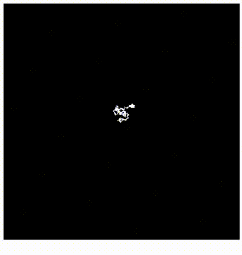
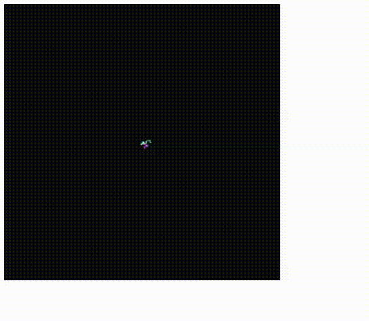
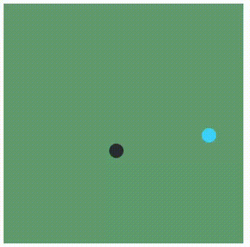

# Nature of Code simulation tryouts for Coding Train NOC

## Introduction
The Coding Train Nature of code series is mainly done using Processing. These tryouts are done on p5js JavaScript library
### I.1 Random Walker

### I.2 Probability: Biased Random Walker

| Direction | Probability |
| ----------- | ----------- |
| Right | 50% |
| Left | 20% |
| Up | 15% |
| Down | 15% |

### I.3 Gaussian Distribution
| Mean | Standard Deviation |
| ----------- | ----------- |
| 250 | 50 |

### I.4 Custom Distribution

### I.5: Perlin Noise

Perlin Noise => Black Circle
Random => Blue Circle

### 1.1: Bouncing Ball

### 1.3: Pointer

### 1.6: Acceleration towards Mouse

### 2.2
#### 2.2.1 Applying Force
#### 2.2.2 MoverWithBounds

### 2.3 Simulating With Mass
### 2.4 Friction Force

### 2.5 Drag force

### 2.6 Gravitational Attraction

### 3.2 Angular Motion: Spiral

### 3.3 Simple harmonic Motion

### 3.4 Pendulum Simulation

### 3.5 Springs

### 4.1 Particle

### 4.2 Particle Lit

### 4.4 Particle System

### 4.5 Particle System: Inheritance

### 4.8 Particle System: Applying Force